# Plant Disease AI Project Documentation


---

## Live Demo

[](https://nabta-system.tech)

---

## Demo Preview


---

## Project Overview

NABTA AI System is a full-stack AI-powered platform designed for plant disease detection, analysis, and monitoring. The system integrates advanced computer vision models with modern web technologies to provide a complete intelligent pipeline for agricultural diagnostics.

The platform enables users to upload plant images and receive detailed AI-driven insights, including detection, classification, segmentation, and historical analytics.

---

## Core Capabilities

- Object detection using YOLOv8 to localize plant regions  
- Disease classification using deep convolutional neural networks  
- Segmentation of infected regions using U-Net architecture  
- Visual explainability using Grad-CAM  
- Real-time inference and result visualization  
- Persistent storage and analytics dashboard  

---

## AI Models

- YOLOv8 for object detection  
- CNN models (PyTorch and TensorFlow) for classification  
- U-Net for segmentation  
- Grad-CAM for interpretability  

---

## LLM and AI Assistant

The system includes an AI-powered assistant built using Cohere LLM.

Key characteristics:

- Retrieval-Augmented Generation (RAG) pipeline  
- Custom prompt engineering for plant-related queries  
- Context-aware responses based on domain-specific knowledge  
- Custom Retrieval-Augmented Generation (RAG) pipeline tailored for plant domain queries 
- Designed to assist users with plant care, disease understanding, and recommendations  

### LLM Workflow

The assistant follows a structured pipeline to ensure secure, context-aware, and domain-specific responses:

1. User sends query from frontend (AI Assistant)
2. Request is forwarded to Firebase Function (secure proxy)
3. Context is dynamically constructed (RAG-style)
4. Prompt is injected with domain-specific knowledge
5. Request is sent to Cohere API
6. Response is returned securely to frontend

---

## Technology Stack

### Frontend
- React with Vite  
- Modular component architecture  
- Context API for state management  
- Firebase Authentication  
- Responsive UI design  

### Backend
- FastAPI for API development  
- Python for AI processing  
- Docker for containerization  

### AI and Machine Learning
- PyTorch  
- TensorFlow / Keras  
- OpenCV  
- Albumentations  

### Cloud and Services
- Firebase (Authentication and Firestore database)  
- Netlify for frontend deployment  

---

## Features

- Plant disease detection pipeline  
- Classification with explainability (Grad-CAM)  
- Segmentation of infected areas  
- AI assistant powered by LLM and RAG  
- Historical tracking and analytics  
- User profile management  
- Premium system with custom dataset support  
- Multi-language support  

---

## System Screenshots

### Authentication

Login  
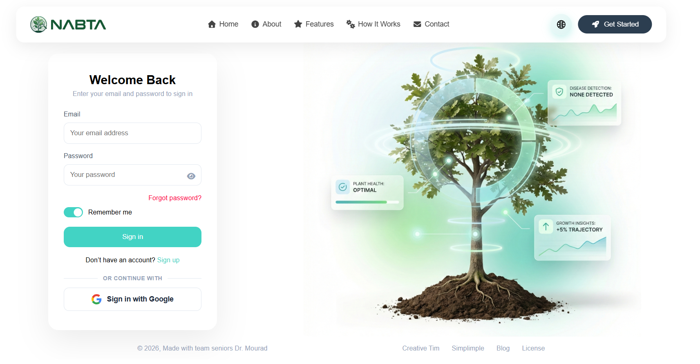

Signup  
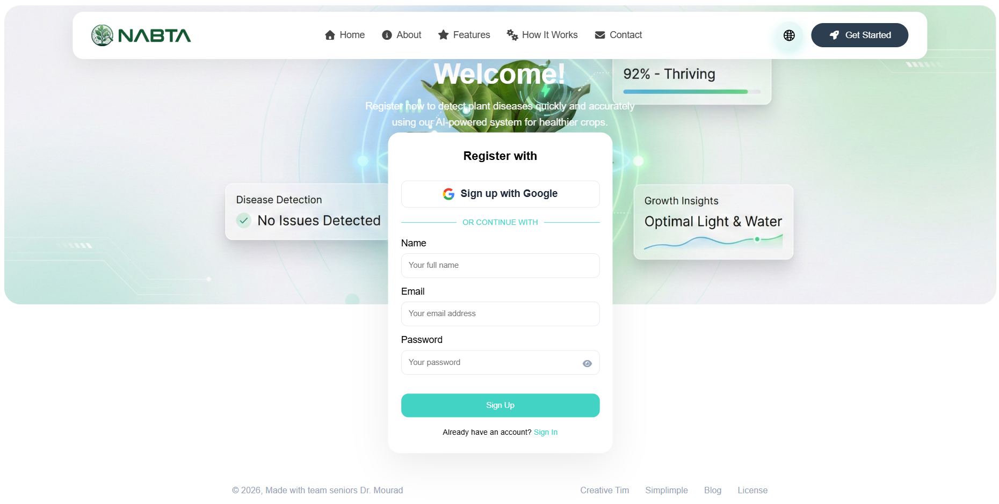

Reset Password  
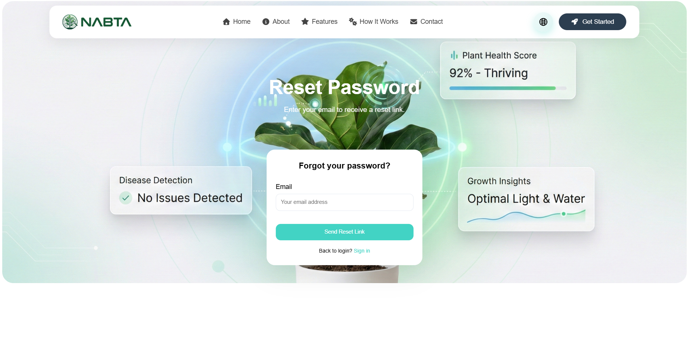

---

### Plant Analysis

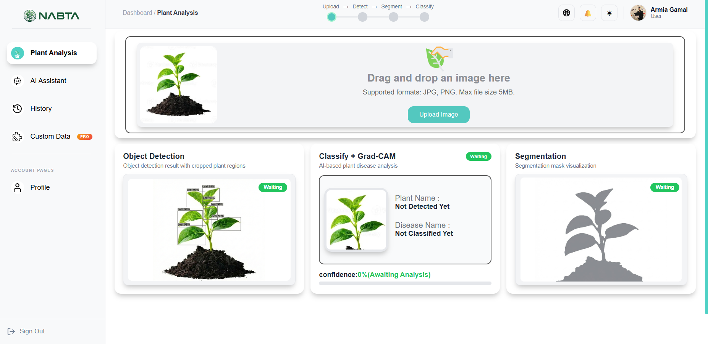

---

### Dashboard

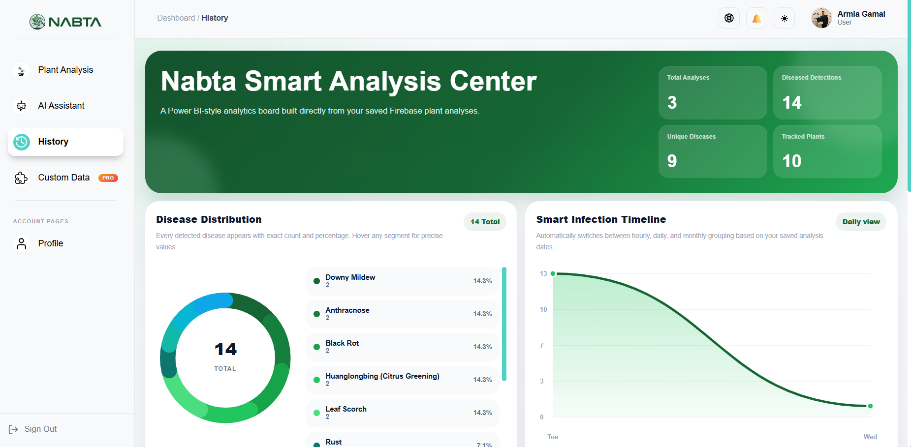

---

### AI Assistant

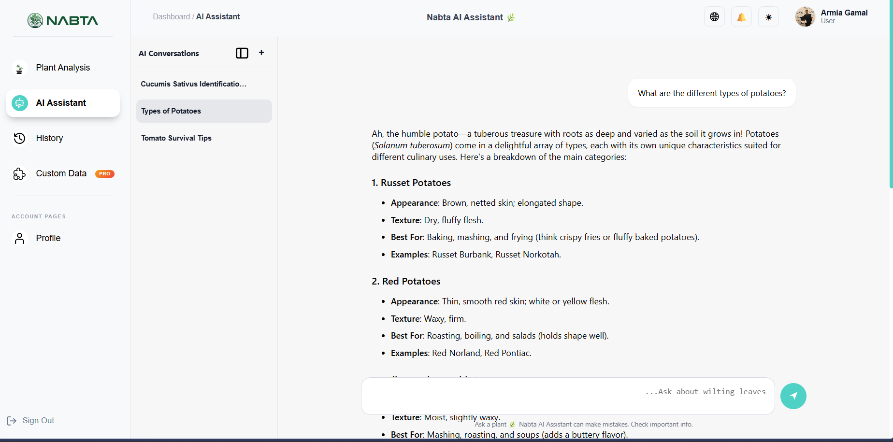

---

### User Profile

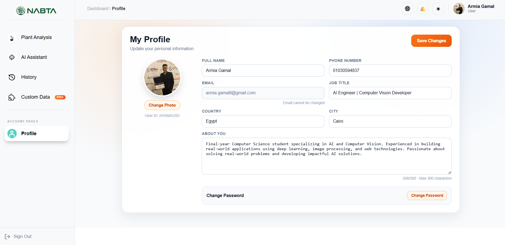

---

### Premium System

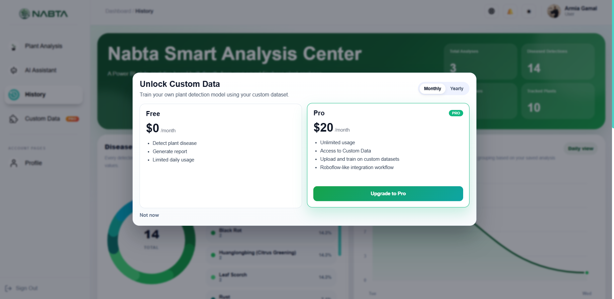

---

## Project Structure

The project is organized into two main parts:

1. Backend functions (Firebase Cloud Functions)
2. Frontend application (React-based UI)

---

### Backend (Firebase Functions)

```
functions/
│
├── .env                     # Stores environment variables (Gmail credentials, Cohere API key)
├── .eslintrc.js            # ESLint configuration for code quality and formatting rules
├── .gitignore              # Specifies files/folders to ignore in version control
├── index.js                # Main entry point for all Firebase Cloud Functions
├── package.json            # Project dependencies and scripts configuration
├── package-lock.json       # Exact dependency versions for consistent installs
```

#### Explanation

* **.env**
  Contains sensitive configuration such as:

  * Gmail credentials (used for sending emails)
  * Cohere API key (used for LLM integration)

* **.eslintrc.js**
  Defines linting rules to enforce clean and consistent JavaScript code.

* **index.js**
  Core backend logic that includes:

  1. **sendWelcomeEmail**

     * Triggered via HTTPS callable function
     * Sends a welcome email using Nodemailer and Gmail SMTP
     * Requires authenticated user

  2. **keepHuggingFaceAlive**

     * Scheduled function (runs every 10 minutes)
     * Sends a request (ping) to Hugging Face API
     * Prevents model cold-start or sleep

  3. **cohereChat**

     * Secure proxy for Cohere LLM API
     * Prevents exposing API key on frontend
     * Supports chat-based interaction
     * Integrated with RAG-style prompting

* **package.json / package-lock.json**
  Manage dependencies such as:

  * firebase-functions
  * firebase-admin
  * nodemailer
  * node-fetch

---

### Frontend (React Application)

```
src/
│
├── App.jsx                 # Root component that manages routing and layout structure
├── App.css                 # Global styles for the main app container
├── main.jsx                # Entry point that mounts React app to the DOM
├── index.css               # Base styling and resets
├── firebase.js             # Firebase configuration (Auth + Firestore integration)
│
├── assets/
│   ├── fonts/
│   │   ├── Cairo-Bold.ttf        # Custom font (bold)
│   │   └── Cairo-Regular.ttf     # Custom font (regular)
│   │
│   ├── images/
│   │   └── (UI icons, backgrounds, plant images, reusable visual assets)
│   │
│   └── pdf/
│       └── vfs_fonts.js          # PDF font support (used for report generation)
│
├── components/
│   ├── Dashboard/
│   │   ├── Dashboard.jsx         # Main dashboard UI container
│   │   ├── Dashboard.css         # Dashboard styling
│   │   ├── DashboardLayout.jsx   # Layout wrapper for dashboard pages
│   │   └── DashboardNavbar.jsx   # Top navigation bar inside dashboard
│   │
│   ├── Footer/
│   │   ├── Footer.jsx            # General footer component
│   │   └── Footer.css            # Footer styling
│   │
│   ├── LandingFooter/
│   │   ├── LandingFooter.jsx     # Footer for landing pages
│   │   └── LandingFooter.css     # Styling for landing footer
│   │
│   ├── layouts/
│   │   ├── LandingLayout.jsx     # Layout for landing/public pages
│   │   ├── PublicLayout.jsx      # Layout for authentication pages
│   │   └── ProtectedLayout.jsx   # Layout for authenticated users
│   │
│   ├── Navbar/
│   │   ├── Navbar.jsx            # Main navigation bar
│   │   └── Navbar.css            # Navbar styling
│   │
│   ├── PlantModel/
│   │   └── PlantModel.jsx        # Handles plant visualization (3D / UI representation)
│   │
│   ├── Premium/
│   │   ├── CustomDataButton.jsx  # Button for uploading custom datasets
│   │   ├── PlanCard.jsx          # Subscription plan UI card
│   │   ├── PricingModal.jsx      # Pricing popup/modal
│   │   └── PremiumUpgrade.css    # Styling for premium UI
│   │
│   └── Sidebar/
│       ├── Sidebar.jsx           # Sidebar navigation inside dashboard
│       └── Sidebar.css           # Sidebar styling
│
├── context/
│   └── LanguageContext.jsx       # Manages multilingual support across the app
│
├── pages/
│   ├── dashboard/
│   │   ├── AIAssistant/
│   │   │   ├── AIAssistant.jsx   # Chat interface (Cohere LLM + RAG integration)
│   │   │   └── AIAssistant.css   # Styling for chat UI
│   │   │
│   │   ├── CustomData/
│   │   │   ├── CustomData.jsx    # Upload and manage custom datasets (premium feature)
│   │   │   └── CustomData.css
│   │   │
│   │   ├── History/
│   │   │   ├── History.jsx       # Displays past analysis results
│   │   │   └── History.css
│   │   │
│   │   ├── PlantAnalysis/
│   │   │   ├── PlantAnalysis.jsx # Core AI workflow (upload → detect → classify → segment)
│   │   │   └── PlantAnalysis.css
│   │   │
│   │   └── Profile/
│   │       ├── Profile.jsx       # User profile and account management
│   │       └── Profile.css
│   │
│   ├── Landing/
│   │   ├── Landing.jsx           # Main landing page
│   │   └── Landing.css
│   │
│   ├── Login/
│   │   ├── Login.jsx             # Login page (Firebase Auth)
│   │   └── Login.css
│   │
│   ├── ResetPassword/
│   │   ├── ResetPassword.jsx     # Password reset functionality
│   │   └── ResetPassword.css
│   │
│   └── signup/
│       ├── signup.jsx            # User registration page
│       └── signup.css
│
└── routes/
    └── ProtectedRoute.jsx        # Middleware for route protection (auth guard)
```

---

## Backend Logic Summary

The backend is built using Firebase Cloud Functions and provides three core services:

### 1. Email Service

* Sends welcome emails after user registration
* Uses Nodemailer with Gmail SMTP
* Fully secured using environment variables

### 2. Model Keep-Alive System

* Runs every 10 minutes using a scheduler
* Sends a request to Hugging Face hosted model
* Prevents cold start and improves performance

### 3. LLM Chat Proxy (Cohere)

* Acts as a secure middleware between frontend and Cohere API
* Prevents exposing API keys
* Supports structured prompting and RAG-based responses
* Can be restricted to authenticated users only

---

## Architecture Overview

The system follows a clean modular architecture:

* Frontend handles UI and user interaction
* Backend functions handle secure operations and external APIs
* AI models are consumed via external endpoints (Hugging Face)
* LLM integration is handled through a secure proxy layer

This design ensures:

* Security (no exposed API keys)
* Scalability (modular components)
* Maintainability (clear separation of concerns)
* Production readiness


---

## System Design & Architecture Diagrams

To provide a comprehensive understanding of the system, the following UML diagrams illustrate the architecture from high-level user interactions to low-level implementation details.

These diagrams are organized from conceptual (Use Case) to procedural (Activity) to structural (Class) views of the system.

### 🔹 Use Case Diagram

Represents the interaction between users, the system, and external services.

[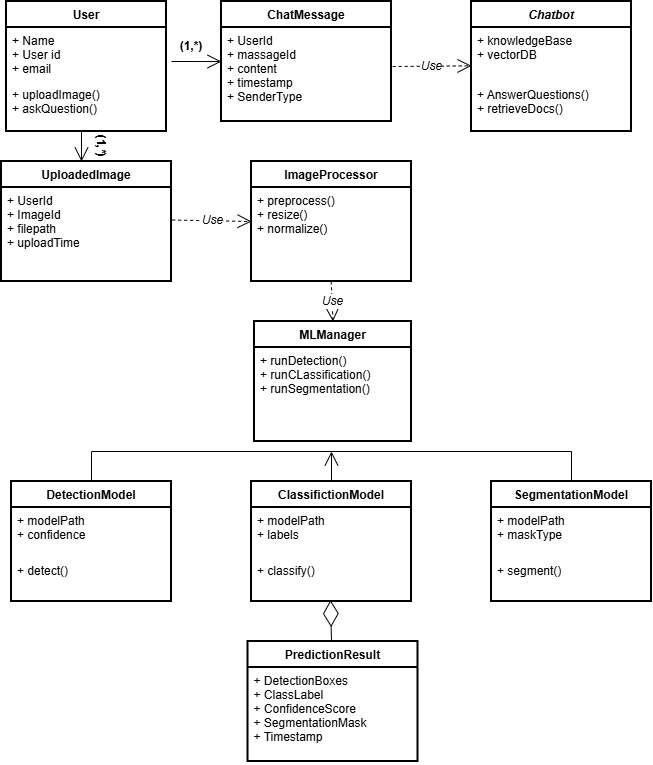](./images/usecase.png)

---

### 🔹 Activity Diagram

Illustrates the complete workflow of the system, from user actions to AI-driven processing and result generation.

[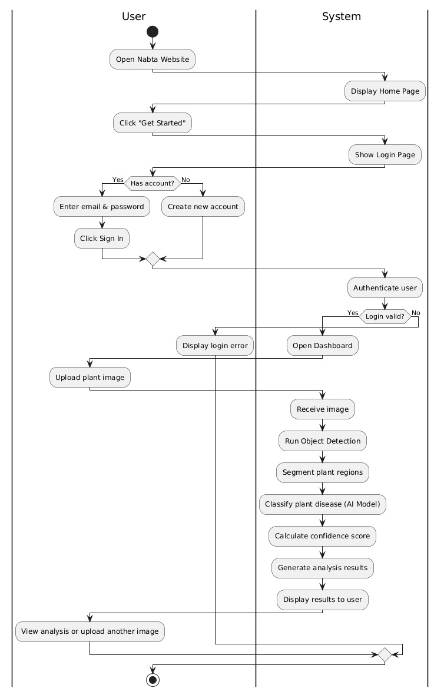](./images/activity.jpeg)

---

### 🔹 Class Diagram

Describes the internal structure of the system, including core components, relationships, and data flow.

[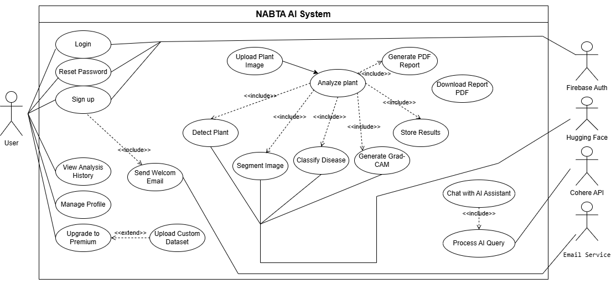](./images/class.png)

---

## System Workflow

1. User uploads a plant image  
2. YOLOv8 detects plant regions  
3. CNN classifies disease type  
4. U-Net generates segmentation mask  
5. Grad-CAM provides visual explanation  
6. Results are stored and displayed in dashboard  

---

## Dataset

- Over 120,000 images  
- 102 classes  
- Includes healthy and diseased plants  
- Covers multiple lighting and environmental conditions  

---

## Authentication and Security

- Firebase Authentication  
- Secure login and registration  
- Route protection using custom middleware  

---

## Future Enhancements

- Mobile application version  
- Advanced multilingual LLM support  
- Expanded dataset coverage  
- Edge deployment for real-time inference  
- Model optimization for low-latency environments  

---

## Team

**Supervisor: Dr. Mourad Raafat**

Meet the team behind NABTA AI System.

<table>
  <tr>
    <td align="center">
      <b>Armia Gamal</b><br/>
      AI BACKEND ENGINEER
    </td>
    <td align="center">
      <b>Sara Essam</b><br/>
      Computer Vision Engineer
    </td>
    <td align="center">
      <b>Sherif Karam</b><br/>
      ML Engineer
    </td>
    <td align="center">
      <b>Salsabel Esmail</b><br/>
      Data Science Engineer
    </td>
    <td align="center">
      <b>Ziad Walid Mokhtar</b><br/>
      ML Engineer
    </td>
    <td align="center">
      <b>Peter Bolbol</b><br/>
      Front-End Engineer
    </td>
    <td align="center">
      <b>Shada Ayman ElDin</b><br/>
      NLP Engineer
    </td>
  </tr>
</table>

---

## Conclusion

This project represents a complete end-to-end AI system that combines computer vision, backend engineering, frontend development, and large language models.

It demonstrates the ability to build scalable, production-ready AI solutions that solve real-world problems in agriculture.